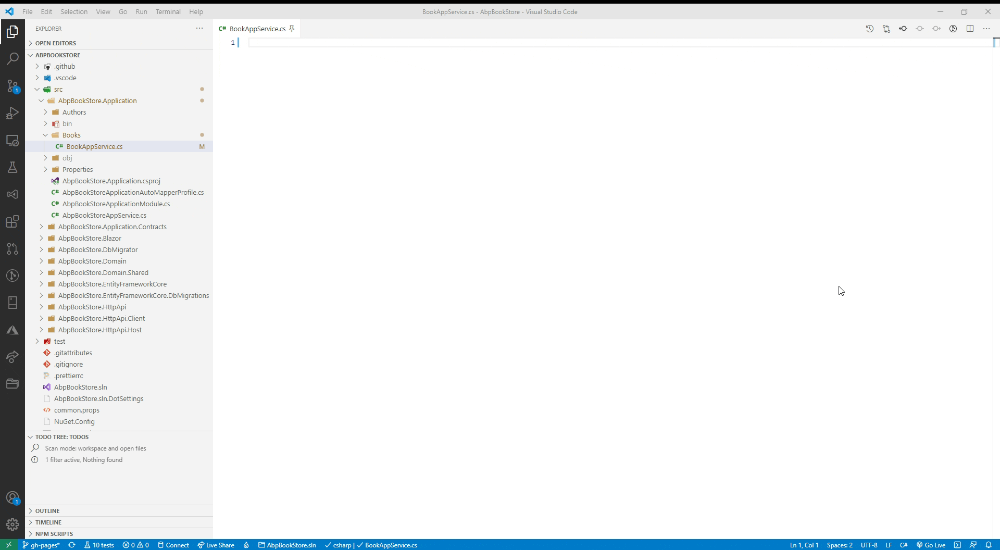

## ABPx - A VsCode Extension to Speed Up the Development Process of an ABP Blazor Application

## Introduction

In this article, I would like to introduce you **ABPx**, a **VsCode Extension** available in the **Visual Studio Marketplace**.

The **main goal** of ABPx, code snippets that **start with an x**, is to **speed up the Development Process** of an **ABP Blazor application** in **Visual Studio Code**.

I noticed that the ABP Framework is rather **convention-based** and you often have to write the same code structures. That's why I started to develop a VsCode Extension with **useful code snippets** to make the life of an ABP developer a little easier.

Please feel free to install the **ABPx extension in VsCode**, and if you see room for improvement or you have a snippet in mind you want to have included? [Create an issue](https://github.com/bartvanhoey/ABPx/issues/new) in the ABPx repository. I will see what I can do! :-)

## Samples

### Generate an AppService class that inherits from the CrudAppService base class

### Source Code

Get the [source code](https://github.com/bartvanhoey/ABPx) of the **ABPx VsCode Extension** on GitHub.

**ABPx** - code snippets that **start with an x**

Enjoy and have fun!
