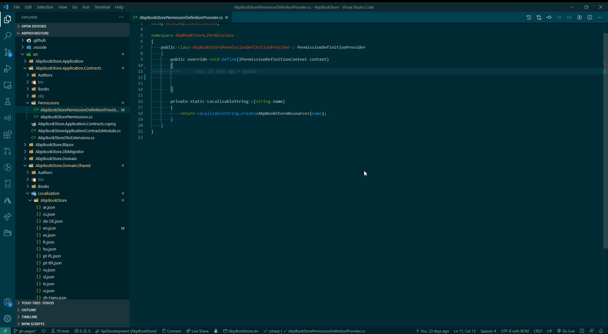

# Code Snippets `that start with an x` to speed up your [(abp.io)](https://abp.io/) development process

PRO TIP: Rename the aspnet-core folder of your abp.io project to [Your-Project-Name] to take full advantage of ABPx

Do you see room for improvement or do you have a snippet in mind you want to have included? Feel free to [create an issue](https://github.com/bartvanhoey/ABPx/issues/new), I will see what I can do!

## C# snippets [(source code)](https://github.com/bartvanhoey/ABPx/blob/master/snippets/csharp.json)

     Prefix                                       | Description                                                                              
     -------------------------------------------- | ----------------------------------------------------------------------------------------- 
     xAddPermissionGroup                          | Add group permission to context in PermissionDefinitionProvider.cs                       
     xAddPermissionToGroup                        | Adds permission to group in PermissionDefinitionProvider.cs                              
     xAddPolicyPermissions                        | Adds policy permissions                                                                  
     xAppServiceClassStub                         | Inserts a complete AppService class stub based upon the [YourProjectName]AppService class
     xApplicationMenuItemIcon                     | New ApplicationMenuItem variable with icon                                               
     xApplicationMenuItemUrl                      | New ApplicationMenuItem variable with url                                                
     xAuthorizeAttributeAbp                       | Inserts the ABP Authorize attribute for a class or a method                              
     xAuthorizeAttributeMicrosoft                 | Inserts the Microsoft.AspNetCore.Authorization Authorize attribute                       
     xBuilderEntity                               | builder.Entity stub                                                                      
     xBusinessExceptionClass                      | Inserts a complete CustomException class that inherits from class BusinessException      
     xCanBeNullAttribute                          | CanBeNull attribute                                                                      
     xCanCreate                                   | Boolean canCreate variable and checks if Create is granted                               
     xCanCrudMethods                              | Checks if CRUD methods are granted                                                       
     xCanDelete                                   | Boolean canDelete variable and checks if Delete is granted                               
     xCanUpdate                                   | boolean canUpdate variable and checks if Edit/Update is granted                          
     xCheckNotNull                                | Check.NotNull statement                                                                  
     xCheckNotNullMaxLength                       | Check.NotNull (+ MaxLength) statement                                                    
     xCheckNotNullMaxMinLength                    | Check.NotNull (+ Max/MinLength) statement                                                
     xCheckNotNullOrEmpty                         | Check.NotNullOrEmpty statement                                                           
     xCheckNotNullOrEmptyMaxLength                | Check.NotNullOrEmpty (+ MaxLength) statement                                             
     xCheckNotNullOrEmptyMaxMinLength             | Check.NotNullOrEmpty (+ Max/MinLength) statement                                         
     xCheckNotNullOrWhiteSpace                    | Check.NotNullOrWhiteSpace statement                                                      
     xCheckNotNullOrWhiteSpaceMaxLength           | Check.NotNullOrWhiteSpace (+ MaxLength) statement                                        
     xCheckNotNullOrWhiteSpaceMaxMinLength        | Check.NotNullOrWhiteSpace (+ Max/MinLength) statement                                    
     xCreateMap                                   | CreateMap from [Type]Dto to [Type] statement                                             
     xCreateMapFromCreateDtoToType                | CreateMap from Create[Type]Dto to [Type] statement                                       
     xCreateMapFromCreateUpdateDtoToType          | CreateMap from CreateUpdate[Type]Dto to [Type] statement                                 
     xCreateMapFromDtoToUpdateDto                 | CreateMap from [Type]Dto to Update[Type]Dto statement                                    
     xCreateMapFromDtoToCreateUpdateDto           | CreateMap from [Type]Dto to CreateUpdate[Type]Dto statement                              
     xCreateMapFromToLookupDto                    | CreateMap from [Type] to [Type]LookupDto statement                                       
     xCreateMapFromUpdateDtoToType                | CreateMap from Update[Type]Dto to [Type] statement                                       
     xCreateMapToDto                              | CreateMap [Type] to [Type]Dto statement                                                  
     xCrudAppServiceCreateDtoAndUpdateDto         | Inserts a complete CrudAppService class with CreateDto and UpdateDto separated           
     xCrudAppServiceCreateUpdateDto               | Inserts a complete CrudAppService class with CreateUpdateDto combined                    
     xCtor                                        | constructor stub                                                                         
     xCtorBusinessException                       | constructor stub in a class derived from BusinessException                               
     xDataTypeAttribute                           | DataType attribute                                                                       
     xDbSet                                       | Inserts a DbSet for a class statement in DbContext                                       
     xEfCoreRepositoryClassStub                   | Inserts EfCoreRepositoryClass stub                                                       
     xEmailAddressAttribute                       | EmailAddress Attribute                                                                   
     xFilterProperty                              | Inserts property Filter                                                                  
     xFindByNameAsyncIRepository                  | Adds a FindByNameAsync method to an IRepository interface                                
     xGetListAsyncIRepository                     | Adds a GetListAsync method to an IRepository interface                                   
     xGetLookupAppService                         | Adds a GetLookupAsync method to an AppService class                                      
     xGetLookupIAppService                        | Adds a GetLookupAsync method to an IAppService interface                                 
     xGps                                         | Inserts { get, private set }                                                             
     xGetRequiredAppService                       | GetRequiredService and an IAppService field                                              
     xGetRequiredService                          | GetRequiredService and matching field                                                    
     xGs                                          | Inserts { get, set }                                                                     
     xGuidGeneratorCreate                         | Inserts GuidGenerator.Create() statement                                                 
     xHasOneWithManyForeignKeyRequired            | Inserts HasOne<Type>().WithMany().ForeignKey().IsRequired statement                      
     xIAppService                                 | Inserts a complete IAppService interface with CRUD methods for a given Type              
     xICrudAppServiceCreateUpdateDto              | Inserts a completed ICrudAppService interface with CreateUpdateDto combined              
     xICrudAppServiceCreateDtoAndUpdateDto        | Inserts a complete ICrudAppService interface with CreateDto and UpdateDto separated      
     xCrudMethodsIAppService                      | Inserts the basic CRUD methods in an IAppService                                         
     xIMongoCollection                            | Inserts as IMongoCollection for a class statement in DbContext                           
     xIRepository                                 | an IRepository for a type parameter                                                      
     xIfInline                                    | Inline if statement                                                                      
     xIfIsGrantedAsyncApplicationMenuItem         | if IsGranted permission statement                                                        
     xIfNotNullInline                             | Inline if not null statement                                                             
     xIfNotNull                                   | If not null statement                                                                    
     xIfNullInline                                | Inline if not null statement                                                             
     xIfNull                                      | If null statement                                                                        
     xIfRepoGetCountAsync                         | Inserts if(await _repository.GetCountAsync() ? 0) statement                              
     xIf                                          | If statement                                                                             
     xImpIHasCreationTime                         | Implements IHasCreationTime interface                                                    
     xImpIApplicationService                      | Implements IApplicationService interface                                                 
     xImpIDataSeedContributor                     | Implements IDataSeedContributor interface                                                
     xImpIRepository                              | Implements IRepository interface                                                         
     xImpITransientDependency                     | Implements ITransientDependency interface                                                
     xInhBusinessException                        | Inherits BusinessException class                                                         
     xInhSpecification                            | Inherits Specification class                                                             
     xInhAggregateRoot                            | Inherits AggregateRoot class                                                             
     xInhAppService                               | Inherits ProjectNameAppService class                                                     
     xInhApplicationService                       | Inherits ApplicationService class                                                        
     xInhApplicationTestBase                      | Inherits ApplicationTestBase class                                                       
     xInhAuditedAggregateRoot                     | Inherits AuditedAggregateRoot class                                                      
     xInhAuditedEntity                            | Inherits AuditedEntity class                                                             
     xInhAuditedEntityDto                         | Inherits AuditedEntityDto class                                                          
     xInhCreationAuditedAggregateRoot             | Inherits CreationAuditedAggregateRoot class                                              
     xInhCreationAuditedEntity                    | Inherits CreationAuditedEntity class                                                     
     xInhCreationAuditedEntityDto                 | Inherits CreationAuditedEntityDto class                                                  
     xInhDomainService                            | Inherits DomainService class                                                             
     xInhDomainTestBase                           | Inherits DomainTestBase class                                                            
     xInhEntity                                   | Inherits Entity class                                                                    
     xInhEntityDto                                | Inherits EntityDto class                                                                 
     xInhFullAuditedAggregateRoot                 | Inherits FullAuditedAggregateRoot class                                                  
     xInhFullAuditedEntity                        | Inherits FullAuditedEntity class                                                         
     xInhFullAuditedEntityDto                     | Inherits FullAuditedEntityDto class                                                      
     xInhPagedAndSortedResultRequestDto           | Inherits PagedAndSortedResultRequestDto class                                            
     xInjectAppService                            | Inserts Inject IMyAppService MyAppService statement                                      
     xInjectHttpClient                            | Inject HttpClient property                                                               
     xInjectIJSRuntime                            | Inject IJSRuntime property                                                               
     xInjectIMapper                               | Inject IMapper property                                                                  
     xInjectNavigationManager                     | Inject NavigationManager property                                                        
     xInjectService                               | Inject IMyService MyService                                                              
     xLookupListAppService                        | Inserts an IReadOnlyList for a LookupDto object                                          
     xMethodAsync                                 | async method stub without arguments                                                      
     xMethodAsyncReturn                           | async task method stub                                                                   
     xMethodAsyncWithArgs                         | async method stub with arguments                                                         
     xMethodReturn                                | method stub without arguments                                                            
     xMethodVoid                                  | void method stub without arguments                                                       
     xMethodVoidWithArgs                          | void method stub with arguments                                                          
     xNotNullAttribute                            | NotNull attribute                                                                        
     xObjectMapperMap                             | ObjectMapper.Map statement                                                               
     xPermissionClass                             | Inserts a static class with Default/Create/Update/Delete constants                       
     xPropPrivateSetter                           | property with private setter                                                             
     xRepoDeleteAsync                             | Inserts repository.DeleteAsync statement                                                 
     xRepoGetAsync                                | Inserts var VarName = repository.GetAsync statement                                      
     xRepoGetListAsync                            | Inserts var items = repository.GetListAsync statement                                    
     xRepoInsertAsync                             | Inserts repository.InsertAsync statement                                                 
     xRepoUpdateAsync                             | Inserts repository.UpdateAsync statement                                                 
     xRequiredAttribute                           | Required Attribute                                                                       
     xReturnObjectMapperMap                       | return ObjectMapper.Map statement                                                        
     xReturnObjectMapperToDto                     | return ObjectMapper.Map from SourceType to Dto statement                                 
     xReturnPagedResultDto                        | Inserts return new PagedResultDto statement                                              
     xReturnListResultDto                         | Inserts return new ListResultDto statement                                               
     xStringLengthAttribute                       | StringLength attribute                                                                   
     xAsyncExecuterFirstOrDefaultAsync            | Inserts AsyncExecuter.FirstOrDefaultAsync statement                                      
     xAsyncExecuterToListAsync                    | Inserts AsyncExecuter.ToListAsync statement                                              
     xAsyncExecuterCountAsync                     | Inserts AsyncExecuter.CountAsync statement                                               
     xTestAppServiceGetListAsync                  | Inserts var result = await AppService.GetListAsync statement                             
     xTestAssertThrowsAsyncAbpValidationException | Inserts var exception = Assert.ThrowsAsync<AbpValidationException>                       
     xTestAssertThrowsAsyncBusinessException      | Inserts var exception = Assert.ThrowsAsync<BusinessException>                            
     xTestAssertThrowsAsyncCustomException        | Inserts Assert.ThrowsAsync<YourCustomException>                                          
     xTestAssertThrowsCustomException             | Inserts Assert.Throws<YourCustomException>                                               
     xTestAppServiceCreateAsync                   | Inserts var result = await AppService.CreateAsync statement                              
     xTestMethodTaskStub                          | a xUnit test Task method stub                                                            
     xTestMethodVoidStub                          | a xUnit test void method stub                                                            
     xTestResultTotalCountShouldBeGreater         | Inserts result.TotalCount.ShouldBeGreaterThanOrEqual statement                           
     xThrowBusinessException                      | Inserts throw new BusinessException statement                                            
     xThrowEntityNotFoundException                | Inserts throw new EntityNotFoundException statement                                      
     xThrowUserFriendlyException                  | Inserts throw new UserFriendlyException statement                                        
     xPermissionGroupNameConstant                 | a GroupName constant                                                                     

## Snippets for launch.json and tasks.json files [(source code)](https://github.com/bartvanhoey/ABPx/blob/master/snippets/jsonc.json)

     Prefix      | Description                                                       
     ----------- | ------------------------------------------------------------------ 
     xLaunchJson | Inserts launch configurations in launch.json needed to run project
     xTasksJson  | Inserts tasks in tasks.json needed to run project                 

## Razor snippets [(source code)](https://github.com/bartvanhoey/ABPx/blob/master/snippets/razor.json)

     Prefix                         | Description                                                         
     ------------------------------ | -------------------------------------------------------------------- 
     xAuthorizeAttribute            | xAuthorizeAttribute                                                 
     xCode                          | @code block                                                         
     xCreateModalDialog             | Create modal dialog                                                 
     xDataGridColumn                | Inserts a DataGridColumn                                            
     xDataGridColumnEnum            | Inserts a DataGridColumn for an enum                                
     xDataGridColumnLongDateString  | Inserts a DataGridColumn in long date format                        
     xDataGridColumnShortDateString | Inserts a DataGridColumn in short date format                       
     xFieldDateEdit                 | Inserts a TextEdit field in a Create/Update dialog                  
     xFieldEnumSelect               | Inserts a Select field for enum in a Create/Update dialog           
     xFieldNumericEdit              | Inserts a NumericEdit field in a Create/Update dialog               
     xFieldSelect                   | Inserts a Select field a Create/Update dialog                       
     xFieldTextEdit                 | Inserts a TextEdit field in a Create/Update dialog                  
     xFieldMemoEdit                 | Inserts a MemoEdit field in a Create/Update dialog                  
     xIfCanCreate                   | If CanCreate                                                        
     xIfCanDelete                   | If CanDelete                                                        
     xIfCanUpdate                   | If CanUpdate                                                        
     xInheritsComponentBase         | Inserts @inherits [YourProjectName]ComponentBase statement          
     xInjAuthorizationService       | Injects interface IAuthorizationService                             
     xListAbpCrudPageBase           | Inserts a paged list for a standard CrudAppService                  
     xListIAppService               | Inserts a paged list for a custom IAppService                       
     xPage                          | Inserts @page directive                                             
     xFeedbackValidation            | Inserts <Feedback> validation statement                             
     xPageParam                     | Inserts @page directive with Parameter                              
     xUpdateModalDialog             | Update modal dialog                                                 
     xInjectHttpClient              | Inserts @inject HttpClient directive                                
     xInjectIJSRuntime              | Inserts @inject IJSRuntime directive                                
     xInjectIMapper                 | Inserts @inject IMapper directive                                   
     xInjectService                 | Inserts @inject MyService MyService                                 
     xInjectAppService              | Inserts @inject MyService MyService                                 
     xInjectNavigationManager       | Inserts @inject NavigationManager directive                         
     xInjectProtectedLocalStorage   | Inserts @inject ProtectedLocalStorage directive in Blazor Server app

