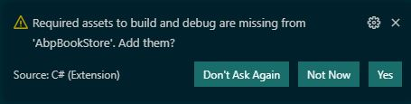
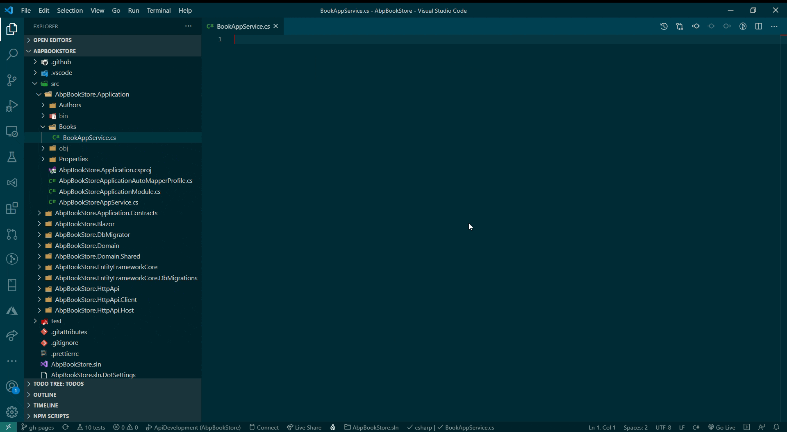

## Code faster with ABPx in Visual Studio Code

**ABPx** - code snippets that **start with an x**

## Introduction

In this article, I would like to introduce you to **ABPx**, a **VsCode Extension** for the ABP Framework, available in the [Visual Studio Marketplace](https://marketplace.visualstudio.com/items?itemName=BartVanHoey.abpx).

The **main goal of ABPx** is to **speed up the development process** of **ABP applications** in **Visual Studio Code**.

When I started learning the ABP Framework, I noticed that the ABP Framework has a **convention over configuration** approach and you often end up writing the same code over and over again. That's why I started to develop a VsCode Extension with **useful code snippets** to make the life of an **ABP Framework developer** a little easier.

## ABPx Code Snippets in Action

Below you will see 3 examples of how to use ABPx code snippets in practice. At the moment of this writing, there are **about 180 ABPx code snippets for C#, razor and jsonc files** that you can use in your daily ABP Framework coding work.

### Generate VsCode Launch Configurations for your ABP application

Starting with an ABP project in VsCode can be a bit of hassle. **ABPx makes it a lot easier** to get you up and running by **generating the launch configurations needed**, as you can see below.

When opening an ABP application in **Visual Studio Code**, the editor will show you **a notification** (if not, hit CTRL+SHIFT+P to Restart OmniSharp).

* Click **Yes** to add the *required assets to build and debug* your application. Select the *IssueTracking.HttpApi.Host* project in the *Select the project to launch* dropdown.

### Generate an AppService class that inherits from the CrudAppService base class

### Create a Permission Group, add Permissions to Permission Group and generate Translations

## ABPx Source Code

Get the [source code](https://github.com/bartvanhoey/ABPx) of the **ABPx VsCode Extension** on GitHub.

## Install ABPx

Please feel free to install the **ABPx extension in VsCode**, and if you see room for improvement or you have a snippet in mind you want to have included? [Create an issue](https://github.com/bartvanhoey/ABPx/issues/new) in the ABPx repository. I will see what I can do! :-)

**ABPx** - code snippets that **start with an x**

Enjoy and have fun!
